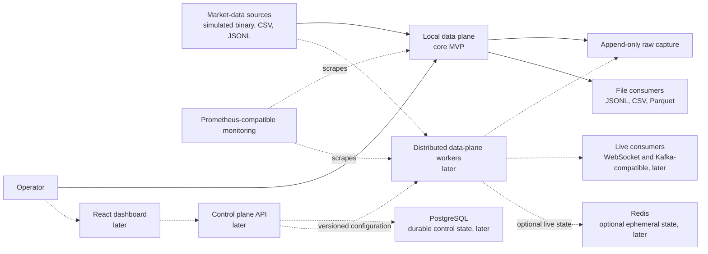
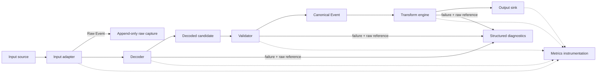
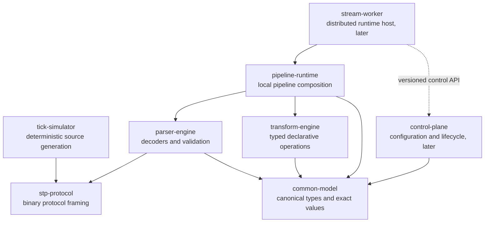

# StreamForge Architecture

StreamForge is currently documentation and directory scaffolding. This document describes the accepted target architecture; it does not claim that the components below have been implemented.

## Architectural Principles

- Normalize every input through one canonical event model before transformation or output.
- Preserve source sequence numbers, nanosecond timestamps, and exact fixed-point financial values end to end.
- Keep high-volume market events out of the control plane.
- Retain immutable raw input so decoding and normalization can be investigated and replayed.
- Permit only validated declarative transformations, never arbitrary user code.
- Establish a working local pipeline before adding distributed infrastructure.

## Technology Baseline

- The backend will use Java 21 in a Maven multi-module project.
- The later dashboard will use React and TypeScript in strict mode.
- The later control plane will use PostgreSQL for durable state.
- Data-plane runtimes will expose Prometheus-compatible metrics.

## Terminology

| Term | Meaning |
| --- | --- |
| Raw Event | Immutable source bytes plus provenance such as source identity, arrival position, and capture time. A Raw Event is captured before decoding. |
| Canonical Event | A validated, source-independent market event with preserved source metadata, exact values, a typed payload, and a stable reference to its Raw Event. |
| Pipeline Run | One execution of a versioned pipeline configuration against one or more inputs, producing outputs, diagnostics, raw capture, and metrics. |
| Control Plane | Low-volume APIs and workflows for pipeline configuration, lifecycle, and status. Its planned durable store is PostgreSQL. |
| Data Plane | High-volume ingestion, decoding, validation, transformation, and output processing. Market events remain entirely within this plane. |

## System Context

The core MVP will run the data plane as a local, single-node process. The dashboard, control plane, PostgreSQL, WebSocket delivery, distributed workers, Redis, and Kafka-compatible streaming are later extensions.

Dashed paths represent later phases. Neither PostgreSQL nor Redis is on the market-event path. Redis will not be required by the parser milestone or core local MVP.

## Data-Plane Components

Every input follows the same processing path:

**Input Adapter -> Decoder -> Validator -> Canonical Model -> Transform Engine -> Output Sink**

### Stage Boundaries

- An input adapter reads and frames one source format. It emits Raw Events and does not know about output formats.
- A decoder interprets source bytes and produces a typed candidate without discarding source precision or provenance.
- A validator enforces structural and domain invariants before constructing a Canonical Event.
- The canonical model is the only contract shared by transform engines and output sinks.
- The transform engine validates and executes a versioned, typed operation tree.
- Transformations cannot remove or rewrite source identity, source sequence, event timestamp, schema metadata, or Raw Event provenance.
- An output sink serializes Canonical Events for one destination and never parses source formats.
- Decode, validation, and transformation failures produce structured local diagnostics retaining the Raw Event reference. Distributed dead-letter handling is deferred.

This boundary prevents direct N-by-M input/output converters. Adding an input requires an adapter and decoder into the canonical model; adding an output requires one sink from that model.

## Canonical Event and Raw Capture

A Canonical Event will use a typed envelope containing at least:

- Schema version and event type.
- Source identity and source sequence number.
- Event timestamp with nanosecond precision.
- Instrument identity and a typed event payload.
- Stable Raw Event reference.

Prices and other exact financial values will use a fixed-point representation consisting of a signed unscaled integer and an explicit scale. Arithmetic will be checked for overflow and incompatible scales. `float` and `double` will not be used for monetary values.

Raw bytes and provenance will be written to append-only capture before decoding. The core MVP will use local capture artifacts associated with a Pipeline Run. Canonical Events and diagnostics will carry stable references into those artifacts, allowing later debugging and replay without embedding raw bytes in every event.

## Control Plane and Data Plane

The core MVP will not require a control-plane service. A local Pipeline Run will load a validated configuration directly.

In a later phase, the control plane will store durable configuration and lifecycle state in PostgreSQL, and a React dashboard written in strict TypeScript will use its API. Workers will obtain immutable, versioned configuration snapshots through a control-plane API; they will not read the control-plane database. Market events will not pass through the control plane. Prometheus-compatible monitoring will scrape data-plane metrics independently of control operations.

Kafka-compatible streaming will be introduced only after the local pipeline works. Redis may later hold replaceable, ephemeral live state, but correctness and parser operation will not depend on it.

## Backend Module Boundaries

Solid arrows below mean Maven module dependencies. The dashed arrow is a later runtime API interaction, not a Java module dependency.

No module may bypass these boundaries through circular dependencies. In particular, `common-model` will contain domain contracts rather than parser, transform, storage, or transport implementations.

## Risks and Tradeoffs

| Risk or tradeoff | Architectural response |
| --- | --- |
| A canonical model can hide source-specific semantics. | Preserve raw bytes and provenance, version the canonical schema, and use typed extensions rather than source-specific output paths. |
| Raw capture increases storage use. | Keep capture append-only and run-scoped; define retention controls before production use. |
| Fixed-point arithmetic requires scale and overflow rules. | Make scale explicit, validate compatibility, and fail with structured diagnostics instead of rounding or overflowing silently. |
| A typed transformation AST is less expressive than code. | Favor deterministic, auditable operations and add versioned operators only when justified. |
| Metrics labels can create unbounded cardinality. | Restrict labels to bounded dimensions and keep event identifiers and instrument identifiers out of metric labels. |
| Separate control and data planes add operational concepts. | Keep the core MVP local and introduce the control plane only when remote lifecycle management is needed. |
| Parquet favors batching while streaming favors low latency. | Let the Parquet sink batch within explicit bounds without changing upstream event semantics. |
| Delaying Kafka can expose integration assumptions later. | Keep runtime boundaries transport-neutral and prove them with local sources and sinks first. |

## Core MVP Non-Goals

- A React dashboard or remotely managed control plane.
- PostgreSQL-backed configuration or lifecycle state.
- Redis, Kafka-compatible transport, distributed workers, or horizontal scaling.
- WebSocket delivery or other live-client protocols.
- Direct connectivity to live exchanges or production high-availability guarantees.
- Replay control APIs, distributed dead-letter queues, or order-book reconstruction.
- Arbitrary JavaScript, shell commands, reflection, or general-purpose user expressions.
- Order management, strategy execution, portfolio accounting, or settlement.

## Core MVP Definition of Done

The core MVP will be complete when:

- Simulated binary tick data, CSV, and JSONL can enter one local pipeline through separate adapters and decoders.
- Raw input is captured before decoding and all successful events pass through the validated canonical model.
- Nanosecond timestamps, source sequence numbers, and exact fixed-point financial values survive normalization and output without precision loss.
- Versioned declarative transformations can filter, map, derive, and project supported fields without executing arbitrary code.
- JSONL, CSV, and Parquet sinks consume Canonical Events rather than source-specific records.
- Decode, validation, arithmetic, and transformation failures produce deterministic diagnostics with Raw Event references.
- Prometheus-compatible metrics expose bounded-cardinality pipeline health and processing counters.
- Automated tests cover representative inputs, precision invariants, transformation validation, failure paths, and each output sink.
- README and documentation commands run successfully on a clean local checkout.
